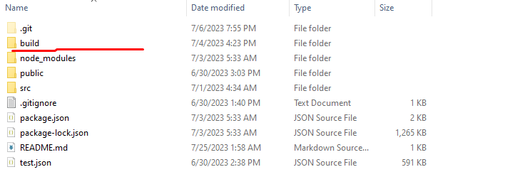
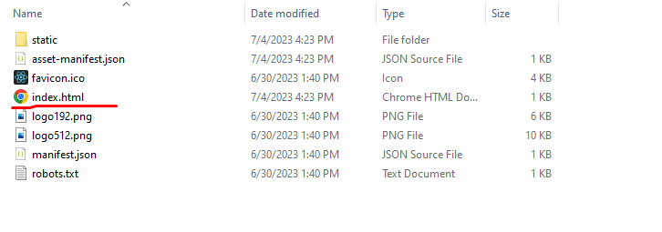

# [LeafletJS map layer and selection menu based on API input](https://www.upwork.com/jobs/~018823e0418cd7fa9a)

# Clone this repository

First, install git on your computer from https://git-scm.com/downloads

```
git clone https://github.com/dariusprince90/geoclaim_react.git
```

# How to install local development environment

You have to install node on your platform, latest version is prefered.

```
npm install
```

# How to run

```
npm start
```

# How to build

```
npm run build
```

This command will create `build` folder on your project directory. This is static in which has `index.html` that can be run on VPS. So you can copy this build folder to your VPS



